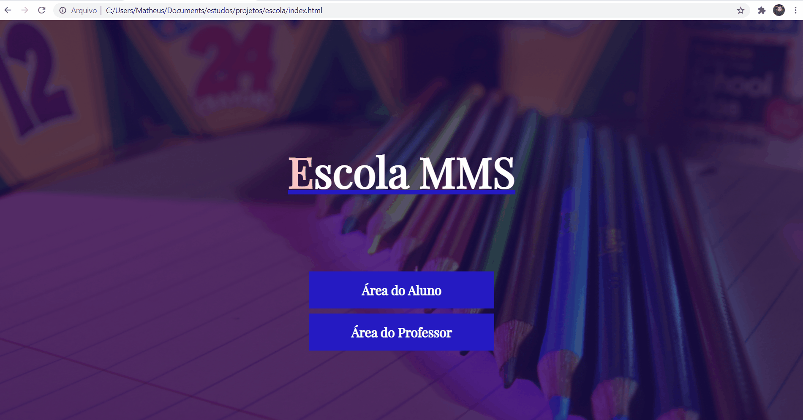

<h1 align="center">Escola MMS</h1>

Site de uma escola fictícia em que o professor consegue atualizar notas, adicionar e remover alunos e os alunos conseguem visualizar as suas notas e médias.

## :camera_flash: Demonstração
<h3>Área do Professor</h3>
</img>

<h3>Área do Aluno</h3>
</img>

## :computer: Teste o Site
<h3>Professor</h3>

Email: reginaldo@professor.com

Senha: 123456

<h3>Aluno</h3>

Email: matheus@aluno.com
 

Senha: 123456

RA: 1234

<a href="https://escolamms.netlify.app/" target="_blank">Clique aqui para testar o site</a>

## :rocket: Tecnologias

As seguintes ferramentes foram utilizadas na construção desse projeto:

- HTML
- CSS
- JavaScript
- Firebase

 
    Made by <a href='https://www.linkedin.com/in/matheus-medeiros-da-silva-6172b5216/'>Matheus Medeiros da Silva</a> :man_technologist:
